# ✨ 플레이리스트 백엔드 개발 가이드 ✨

## 📝 개요

이 문서는 YouTube 플레이리스트의 동영상 데이터를 주기적으로 수집하고, 이를 검색 가능한 형태로 제공하는 백엔드 애플리케이션에 대한 개발 및 배포 가이드입니다. Spring Boot를 기반으로 하며, YouTube Data API와 연동하여 실제 데이터를 가져옵니다.

## 🚀 Docker 로컬 개발 명령어

로컬 환경에서 Docker를 사용하여 백엔드 애플리케이션을 빌드하고 실행하는 방법을 설명합니다.

### 📋 필수 준비물

1. **Docker Desktop 설치:** 당신의 운영체제에 맞는 Docker Desktop이 설치되어 있고 실행 중이어야 합니다.

2. **Docker Hub 계정 및 이메일 인증:** `openjdk` 같은 기본 이미지를 가져오기 위해 Docker Hub 계정에 로그인되어 있고 이메일 인증이 완료되어 있어야 합니다. (로그인 오류 발생 시 `docker logout` 후 `docker login`으로 재로그인 시도)

3. **Gradle 빌드 환경:** `bootJar` 태스크를 실행하여 JAR 파일을 생성할 수 있어야 합니다.

4. **`.env.local` 파일:** 프로젝트 루트 (`playlist/`)에 `YOUTUBE_API_KEY_LOCAL`과 `YOUTUBE_PLAYLIST_ID_LOCAL`이 설정된 `.env.local` 파일이 있어야 합니다.

   ```
   YOUTUBE_API_KEY_LOCAL=YOUR_YOUTUBE_API_KEY
   YOUTUBE_PLAYLIST_ID_LOCAL=YOUR_YOUTUBE_PLAYLIST_ID
   
   ```

### 📦 애플리케이션 빌드 (JAR 파일 생성)

Docker 이미지를 빌드하기 전에, Spring Boot 애플리케이션의 실행 가능한 JAR 파일을 생성해야 합니다.

* **명령어 실행 위치:** `playlist/` (프로젝트 루트) 폴더

* **명령어:**

  ```
  .\gradlew bootJar
  
  ```

* **설명:** 이 명령어를 실행하면 `playlist/build/libs/` 폴더 안에 `playlist-0.0.1-SNAPSHOT.jar` (또는 비슷한 이름) 파일이 생성됩니다. 이 JAR 파일이 Docker 이미지에 포함될 애플리케이션입니다.

### 🐳 Docker 이미지 빌드

JAR 파일이 생성되었다면, 이제 `Dockerfile`을 사용하여 Docker 이미지를 빌드합니다.

* **명령어 실행 위치:** `playlist/` (프로젝트 루트) 폴더 (`Dockerfile`이 있는 위치)

* **명령어:**

  ```
  docker build -t playlist-backend:local .
  
  ```

* **설명:**

  * `docker build`: Docker 이미지를 빌드하는 명령어입니다.

  * `-t playlist-backend:local`: 빌드될 이미지에 `playlist-backend`라는 이름과 `local`이라는 태그를 부여합니다.

  * `.`: `Dockerfile`이 현재 디렉토리(`playlist/`)에 있다는 것을 Docker에게 알려줍니다.

### ▶️ Docker 컨테이너 로컬 실행

빌드된 이미지를 사용하여 Docker 컨테이너를 실행합니다. `.env.local` 파일의 환경 변수들을 컨테이너에 주입합니다.

* **명령어 실행 위치:** `playlist/` (프로젝트 루트) 폴더

* **명령어:**

  ```
  docker run -p 8080:8080 --name playlist-app --env-file .env -d playlist-backend:local
  ```

* **설명:**

  * `-p 8080:8080`: 호스트(당신의 컴퓨터)의 8080 포트를 컨테이너 내부의 8080 포트에 연결합니다.

  * `--name playlist-app`: 컨테이너에 `playlist-app`이라는 이름을 부여합니다. (나중에 쉽게 관리하기 위함)

  * `--env-file .env.local`: `playlist/` 폴더에 있는 `.env.local` 파일을 읽어서 그 안에 정의된 모든 환경 변수를 컨테이너 내부로 주입합니다.

  * `-d`: 컨테이너를 백그라운드(detached mode)에서 실행합니다.

  * `playlist-backend:local`: 실행할 Docker 이미지의 이름과 태그입니다.

* **주의:** 만약 `playlist-app`이라는 이름의 컨테이너가 이미 실행 중이거나 종료된 상태라면, 위 명령어를 실행하기 전에 먼저 삭제해야 합니다.

  ```
  docker rm -f playlist-app
  
  ```

### ✅ 실행 확인

1. **컨테이너 상태 확인:**

   ```
   docker ps
   ```
   `playlist-app` 컨테이너가 `Up` 상태로 떠 있는지 확인합니다.

2. **컨테이너 로그 확인:**

   ```
   docker logs playlist-app
   
   ```

   스프링 부트 애플리케이션의 로그를 확인하여 스케줄러가 정상 작동하고 YouTube API를 호출하는지 확인합니다.

3. **웹 브라우저 접속:**

   * **Swagger UI:** `http://localhost:8080/swagger-ui/index.html`

   * **H2 Console:** `http://localhost:8080/h2-console` (JDBC URL: `jdbc:h2:mem:playlistdb`, User Name: `sa`, Password: 비워둠)

   * **API 호출:** `http://localhost:8080/api/videos` 또는 `http://localhost:8080/api/videos/search?query=검색어`

---

## 🏛️ 백엔드 아키텍처 설계 문서

### 🏷️ 제목 및 개요

**프로젝트명:** YouTube 플레이리스트 동영상 검색 서비스 백엔드
**개요:** 이 서비스는 YouTube Data API를 활용하여 특정 플레이리스트의 동영상 정보를 주기적으로 수집하고, 이를 데이터베이스에 저장하여 검색 및 조회 API를 제공하는 Spring Boot 기반 백엔드 애플리케이션입니다.

### 🗺️ 아키텍처 개요

```mermaid
graph TD
    User -->|HTTP 요청| Frontend(Frontend - Next.js)
    Frontend -->|REST API 호출| Backend(Backend - Spring Boot)

    subgraph Backend Services
        Backend -- API 엔드포인트 --> PlaylistController
        PlaylistController -- 데이터 조회 --> VideoRepository
        Backend -- 주기적 실행 --> PlaylistBatchScheduler
        PlaylistBatchScheduler -- API 호출 --> YouTubeApiClient
        PlaylistBatchScheduler -- 데이터 저장/업데이트 --> VideoRepository
    end

    VideoRepository --> Database[(H2/PostgreSQL)]
    YouTubeApiClient --> |YouTube Data API 호출| YouTubeAPI[YouTube Data API]

    style Frontend fill:#f9f,stroke:#333,stroke-width:2px
    style Backend fill:#bbf,stroke:#333,stroke-width:2px
    style Database fill:#ccf,stroke:#333,stroke-width:2px
    style YouTubeAPI fill:#dcf,stroke:#333,stroke-width:2px
```



* **프런트엔드 (Frontend):** 사용자 요청을 받아 백엔드 API를 호출하는 클라이언트 애플리케이션 (예정).

* **백엔드 (Spring Boot):** REST API를 제공하고, YouTube 데이터를 수집 및 관리하는 핵심 서비스.

    * **`PlaylistController`**: 클라이언트의 API 요청을 처리하고 데이터를 반환합니다.

    * **`PlaylistBatchScheduler`**: 설정된 주기(예: 5분마다)로 YouTube Data API를 호출하여 최신 동영상 데이터를 가져와 데이터베이스에 반영합니다.

    * **`YouTubeApiClient`**: YouTube Data API와 직접 통신하여 동영상 데이터를 조회합니다.

    * **`VideoRepository`**: JPA를 통해 데이터베이스(`playlist_video` 테이블)와 상호작용하며 데이터를 저장, 조회, 업데이트합니다.

* **YouTube Data API:** YouTube 플랫폼의 동영상 및 플레이리스트 정보를 제공하는 외부 API.

* **데이터베이스 (H2/PostgreSQL):** 동영상 정보를 저장하는 데이터 스토어.

    * **H2:** 로컬 개발 환경에서 사용하는 인메모리 데이터베이스.

    * **PostgreSQL:** 실제 배포 환경에서 사용할 관계형 데이터베이스.

### 📊 ERD (Entity-Relationship Diagram)

애플리케이션의 핵심 엔티티인 `Video`의 구조를 나타냅니다.


### 💻 기술 스택

* **백엔드 프레임워크:** Spring Boot 3.x

* **언어:** Java 17

* **빌드 도구:** Gradle

* **데이터베이스:**

    * 로컬 개발: H2 (인메모리)

    * 배포: PostgreSQL

* **API 연동:** Google API Client Library for Java (YouTube Data API v3)

* **JSON 처리:** Gson

* **자동화:** Project Lombok

* **API 문서:** Springdoc OpenAPI (Swagger UI)

* **환경 변수 관리:** `spring-dotenv` (로컬 개발용), Docker 환경 변수 (배포용)

* **컨테이너화:** Docker

### ⚙️ API 설계

백엔드 애플리케이션이 제공하는 주요 REST API 엔드포인트입니다.

#### 1. 모든 동영상 조회

* **엔드포인트:** `/api/videos`

* **메소드:** `GET`

* **설명:** 데이터베이스에 저장된 모든 YouTube 동영상 목록을 반환합니다.

* **요청 파라미터:** 없음

* **응답:** `Video` 객체 리스트 (JSON)

#### 2. 동영상 검색

* **엔드포인트:** `/api/videos/search`

* **메소드:** `GET`

* **설명:** 동영상 제목 (`title`) 또는 원본 콘텐츠 소유자 채널 이름 (`videoOwnerChannelTitle`)을 기준으로 동영상을 검색합니다. 검색어가 없으면 모든 동영상을 반환합니다.

* **요청 파라미터:**

    * `query` (Optional, `String`): 검색할 키워드. (예: `Young Gun`, `최신곡`)

* **응답:** `Video` 객체 리스트 (JSON)
