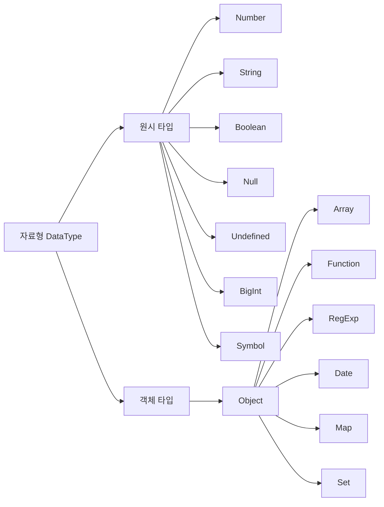

# javascript 기초

## 연산자 (operator)

### null 병합 연산자 (nullish coalescing operator)

```js
// -> 존재하는 값을 추려내는 기능
// -> null, undefined가 아닌 값을 찾아내는 연산자

let var1;
let var2 = 10;
let var3 = 20;

let var4 = var1 ?? var2;
let var5 = var1 ?? var3;
let var6 = var3 ?? var2;

let userName;
let userNickName = "Winterlood";

let displayName = userName ?? userNickName;
```

### typeof 연산자

```js
// -> 값의 타입을 문자열로 반환하는 기능을 하는 연산자

let var7 = 1;
var7 = "hello";
var7 = true;

let t1 = typeof var7;
console.log(t1);
```

### 함수

- Hoist : 감아 올리기
- Hoisting (호이스팅) : 자바스크립트 인터프리터가 코드를 실행하기 전 변수 선언과 함수 선언을 해당 범위의 최상단으로 끌어올려 미리 메모리에 할당

```js
// 함수
let area1 = getArea(10, 20);
console.log(area1);

let area2 = getArea(30, 20);
console.log(area2);

getArea(120, 200);
// 호이스팅
function getArea(width, height) {
  function another() {
    // 중첩 함수
    console.log("another");
  }

  another();
  let area = width * height;

  return area;
}
```

## 화살표 함수 (Arrow function expressions)

### 함수 선언식

```js
function funcA() {
  //   console.log("funcA");
}

let varA = funcA;
varA();
```

### 함수 표현식

함수 표현식 : 표현식으로 만든 함수들은 호이스팅의 대상이 되지 않는다.

```js
let varB = function funcB() {
  // console.log("funcB");
};

// funcB(); 호풀 불가
```

funcB 이름 생략 가능

### 익명함수

이름이 없는 함수

```js
let varB = function () {
  // console.log("funcB");
};

varB();
```

### 화살표 함수

익명함수에서 function 을 지워버리고 => 화살표를 적는다

```js
let varC = () => {
  return 1;
};
```

값을 반환하기만 한다면 중괄호와 return 생략 가능

```js
let varC = () => 1;
```

매개변수가 필요하다면 소괄호 안에 적어준다

```js
let varC = (value) => value + 1;
console.log(varC(10));
```

추가적인 작업이 필요하다면 중괄호로 열어주고 return 문 작성

```js
let varC = (value) => {
  console.log(value);
  return value + 1;
};

console.log(varC(10));
```

## 콜백 함수 (callback function)

자신이 아닌 다른 함수에 인수로서 전달된 함수

```js
function main(value) {
  value();
}

function sub() {
  console.log("i am sub");
}
main(sub); // sub : 콜백(나중에 실행되는)함수
```

```js
// main 안에 sub인수 함수 그대로 적어줘도 된다.
main(function sub() {
  console.log("i am sub");
});

// 함수 표현식에서는 익명함수로 써도 된다.
main(function () {
  console.log("i am sub");
});

// 화살표 함수로 만들어서 써도 된다
main(() => {
  console.log("i am sub");
});
```

```js
// callback 함수를 count 횟수만큼 실행
function repeat(count, callback) {
  for (let idx = 1; idx <= count; idx++) {
    callback(idx);
  }
}

repeat(5, function (idx) {
  console.log(idx);
});

repeat(5, (idx) => {
  console.log(idx);
});

repeat(5, (idx) => {
  console.log(idx * 2);
});

repeat(5, (idx) => {
  console.log(idx * 3);
});
```

## 객체 (Object)

- 원시 타입이 아닌 객체 타입의 자료형
- 여러가지 값을 동시에 저장할 수 있는 자료형을 의미

### 객체 생성

```js
let object1 = new object(); // 객체 생성자
let object2 = {}; // 객체 리터럴
```

### 객체 프로퍼티

```js
let person = {
  // 객체 프로퍼티 (객체 속성) key : value
  // 프로퍼티 갯수 제한 없음
  // value 에 타입 제한 없음 (함수, 객체 등 모두 가능)
  // key 에는 문자나 숫자만 가능
  name: "이경화", // name 프로퍼티
  age: 32, // age 프로퍼티
  hobby: "crossfit", // hobby 프로퍼티
  "like cat": true, // key에 따옴표를 안붙여도 되지만 띄어쓰기가 있을때는 붙여줘야 한다
};
```

### 프로퍼티 접근방법

#### 특정 프로퍼티에 접근 (점 표기법, 괄호 표기법)

```js
let name = person.name;
let age = person["age2"];

let property = "hobby";
let hobby = person[property];
```

#### 새로운 프로퍼티 추가

```js
person.job = "fe developer";
person["favoriteFood"] = "떡볶이";
```

#### 프로퍼티 수정

```js
person.job = "educator";
person["favoriteFood"] = "초콜릿";
```

#### 프로퍼티 삭제

```js
delete person.job;
delete person["favoriteFood"];
```

#### 프로퍼티의 존재 유무를 확인하는 방법 (in 연산자)

````js
let result1 = "name" in person;
let result2 = "cat" in person;
console.log(result2);```
````

#### 상수 객체

```js
const animal = {
  type: "고양이",
  name: "나비",
  color: "black",
};

animal.age = 2; // 추가
animal.name = "까망이"; // 수정
delete animal.color; // 삭제
```

#### 메서드 -> 값이 함수인 프로퍼티를 말함

```js
const person = {
  name: "이정환",
  // 메서드 선언
  sayHi() {
    console.log("안녕!");
  },
};

person.sayHi();
person["sayHi"]();
```

## 배열

### 배열 생성

```js
let arrA = new Array(); // 배열 생성자
let arrB = []; // 배열 리터럴(대부분 사용)

let arrC = [1, 2, 3];
```

```js
// 어떤 타입의 값도 다 저장할 수 있다. 길이의 제한도 없다.
let arrC = [1, 2, 3, true, "hello", null, undefined, () => {}, {}, []];
```

```js
// 배열 요소 접근
let item1 = arrC[0];
let item2 = arrC[1];

arrC[0] = "hello";
console.log(arrC);
```

## Trythy Falsy

```js
// 1. Falsy한 값
let f1 = undefined;
let f2 = null;
let f3 = 0;
let f4 = -0;
let f5 = NaN;
let f6 = "";
let f7 = 0n;

// 2. Truthy 한 값
// -> 7가지 Falsy 한 값들 제외한 나머지 모든 값
let t1 = "hello";
let t2 = 123;
let t3 = [];
let t4 = {};
let t5 = () => {};

// 3. 활용 사례
function printName(person) {
  if (!person) {
    console.log("person의 값이 없음");
    return;
  }
  console.log(person.name);
}

let person = { name: "이정환" };
printName(person);
```

## 단락평가(Short-circuit Evaluation)

첫번째 피연산자의 값만으로도 해당 연산의 결과를 확정할 수 있다면 두번째 피 연산자의 값에는 아예 접근하지 않음

```js
let varA = false;
let varB = true;

console.log(varA && varB);
console.log(varB || varA);
```

```js
function printName(person) {
  const name = person && person.name;
  console.log(name || "person의 값이 없음");
}

printName();
printName({ name: "이정환" });
```

## 구조분해할당

배열이나 객체에 저장된 여러개의 값을들 분해해서 각각 다른 변수에 할당

### 배열의 구조분해 할당

```js
let arr = [1, 2, 3];
let [one, two, three] = arr;
console.log(one, two, three);
```

```js
let arr = [1, 2, 3];
let [one, two, three, four = 4] = arr; // 기본값 설정 가능
```

### 객체의 구조분해 할당

```js
let person = {
  name: "이정한",
  age: 27,
  hobby: "테니스",
};

let { name, age, hobby, extra } = person;
console.log(name, age, hobby, extra); // extra undefined

let { name, age: myAge, hobby, extra } = person;
console.log(name, myAge, hobby, extra); // extra undefined
```

### 객체 구조분해 할당을 이용해서 함수의 매개변수를 받는 방법

객체를 넘겼을때 중괄호 사용하여 구조분해 할당 명시

```js
const func = ({name, age, hobby, extra}) => {
  console.log(name age, hobby, extra);
};

func(person);
```

## Spread 연산자

#### 배열

```js
let arr1 = [1, 2, 3];
let arr2 = [4, 5, 6];

let arr3 = [4, arr1[0], arr1[1], arr1[2], arr[3], 5, 6];

let arr4 = [4, ...arr2, 5, 6]; // ... Spread 연산자
```

#### 객체

```js
let obj1 = { a: 1, b: 2 };
let obj2 = { ...obj1, c: 3, d: 4 };
```

#### 함수

```js
let arr1 = [1, 2, 3];

function funcA(p1, p2, p3) {
  console.log(p1, p2, p3); // 1 2 3
}

funcA(...arr1);
```

## Rest 매개변수

나머지 매개변수 : 배열 형태로 한번에 매개변수를 받을 수 있다  
rest매개변수 뒤에는 추가적으로 매개변수를 선언할 수 없다. rest 매개변수가 마지막에 와야 한다

```js
let arr1 = [1, 2, 3];

function funcB(...rest) {
  console.log(rest); // [1, 2, 3]
}
funcB(...arr1);
```

```js
let arr1 = [1, 2, 3];

function funcB(one, ...rest) {
  console.log(rest); // [2, 3]
}
funcB(...arr1);
```

```js
let arr1 = [1, 2, 3];

function funcB(one, two, ...rest) {
  console.log(rest); // [3]
}
funcB(...arr1);
```

## 원시타입 vs 객체타입



- 원시타입(불변값) : 값 자체로써 변수에 저장되고 복사된다. 메모리값 수정 X
- 객체타입(가변값) : 참조값을 통해 변수에 저장되고 복사된다. 메모리값 수정 O

### 객체타입 주의사항

#### 1. 의도치 않게 값이 수정될 수 있다. (side effect)

-> 새로운 객체를 생성하면서 내부 프로퍼티만 복사하는 방식으로 해야 한다.

```js
let o1 = { name: "이정환" };
let o2 = { ...o1 };

o2.name = "홍길동";
```

#### 얕은 복사

객체의 참조값을 복사함. 원본 객체가 수정될 수 있어 위험함

```js
let o1 = { name: "이정환" };
let o2 = o1;
```

#### 깊은 복사

새로운 객체를 생성하면서 프로퍼티만 따로 복사함. 원본 객체가 수정될 일이 없어 안전함

```js
let o1 = { name: "이정환" };
let o2 = { ...o1 };
```

#### 2. 객체간의 비교는 기본적으로 참조값을 기준으로 이루어진다.

```js
let o1 = { name: "이정환" };
let o2 = o1;
let o3 = { ...o1 };

console.log(o1 === o2); // true
console.log(o1 === o3); // false
```

참조값이 아닌 프로퍼티를 기준으로 두 객체를 비교하고 싶다면  
`JSON.stringfy()` : 자바스크립트 내장함수. 객체를 문자열로 변환하는 기능

```js
let o1 = { name: "이정환" };
let o2 = o1;
let o3 = { ...o1 };

console.log(o1 === o2); // true
console.log(o1 === o3); // false
console.log(JSON.stringfy(o1) === JSON.stringfy(o3));
```

#### 3. 배열과 함수도 사실 객체이다.

- 함수 : 호출, 선언 ... 등 기능 추가
- 배열 : 저장, 순회 ... 등 기능 추가

## 반복문으로 배열과 객체 순회하기

### 순회 (Iteration)

배열, 객체에 저장된 여러개의 값에 순서대로 하나씩 접근하는 것을 말함

```js
// 1. 배열 순회
let arr = [1, 2, 3];

// 1.1 배열 인덱스
for (let i = 0; i < arr.length; i++) {
  //   console.log(arr[i]);
}

let arr2 = [4, 5, 6, 7, 8];
for (let i = 0; i < arr2.length; i++) {
  //   console.log(arr2[i]);
}

// 1.2 for of 반복문
for (let item of arr) {
  //   console.log(item);
}

// 2. 객체 순회
let person = {
  name: "이정환",
  age: 27,
  hobby: "테니스",
};

// 2.1 Object.keys 사용
// -> 객체에서 key 값들만 뽑아서 새로운 배열로 반환
let keys = Object.keys(person);

for (let key of keys) {
  const value = person[key];
  //   console.log(key, value);
}

// 2.2 Object.values
// -> 객체에서 value 값들만 뽑아서 새로운 배열로 반환
let values = Object.values(person);

for (let value of values) {
  //   console.log(value);
}

// 2.3 for in
for (let key in person) {
  const value = person[key];
  console.log(key, value);
}
```

## 배열 메서드

### push

배열의 맨 뒤에 새로운 요소를 추가하는 메서드

```js
let arr1 = [1, 2, 3];
const newLength = arr1.push(4, 5, 6, 7);
```

### pop

배열의 맨 뒤에 있는 요소를 제거하고, 반환

```js
let arr2 = [1, 2, 3];
const poppedItem = arr2.pop();
```

### shift

배열의 맨 앞에 있는 요소를 제거, 반환

```js
let arr3 = [1, 2, 3];
const shiftedItem = arr3.shift();
```

### unshift

배열의 맨 앞에 새로운 요소를 추가하는 메서드

```js
let arr4 = [1, 2, 3];
const newLength2 = arr4.unshift(0);
```

### slice

마치 가위처럼, 배열의 특정 범위를 잘라내서 새로운 배열로 반환

```js
let arr5 = [1, 2, 3, 4, 5];
let sliced = arr5.slice(2, 5);
let sliced2 = arr5.slice(2);
let sliced3 = arr5.slice(-3);
```

### concat

두개의 서로 다른 배열을 이어 붙여서 새로운 배열을 반환

```js
let arr6 = [1, 2];
let arr7 = [3, 4];

let concatedArr = arr6.concat(arr7);
console.log(concatedArr);
```

### forEach

모든 요소를 순회하면서 각각의 요소에 특정 동작을 수행시키는 메서드

```js
let arr1 = [1, 2, 3];

arr1.forEach(function (item, idx, arr) {
  console.log(idx, item * 2);
});

let doubleArr = [];
arr1.forEach((item) => {
  doubleArr.push(item * 2);
});

console.log(doubledArr);
```

### includes

배열에 특정 요소가 있는지 확인하는 메서드

```js
let arr2 = [1, 2, 3];
let isInclude = arr2.includes(3);
console.log(isInclude); // true
```

### indexOf

특정 요소의 인덱스(위치)를 찾아서 반환하는 메서드

```js
let arr3 = [1, 2, 3];
let index = arr3.indexOf(2);
console.log(index); //0
```

### findIndex

모든 요소를 순회하면서, 콜백함수를 만족하는 그런 특정 요소의 인덱스(위치)를 반환

```js
let arr4 = [1, 2, 3];
const findedIndex = arr4.findIndex((item) => {
  if (item === 2) return true;
});

console.log(findedIndex); // 1

// return 문 생략
const findedIndex = arr4.findIndex((item) => item === 999); // 조건을 만족하지 않는다면 -1 반환
```

indexOf 라는 메서드는 객체 타입의 값들이 저장된 배열에서는 정확한 요소의 위치를 찾을 수 없음.

```js
let objectArr = [{ name: "이정환" }, { name: "홍길동" }];
console.log(objectArr.indexOf({ name: "이정환" })); // -1 못찾는다.
// indexOf는 얕은 비교로 동작한다. 객체값들은 참조값을 기준으로 비교가 되기 때문에 프로퍼티를 기준으로 비교가 이루어지지 않는다.
console.log(objectArr.findIndex((item) => item.name === "이정환"));
// 아이템의 네임이라는 프로퍼티의 값을 기준으로 비교를 시켜줄 수 있기 때문에 0 이라고 정확한 위치를 찾아낼 수 있다
```

- indexOf: 얕은비교. 단순한 원시타입의 값을 찾을때
- findIndex: 콜백함수를 이용해서 특정 프로퍼티의 값을 기준으로 찾을 수 있다. 복잡한 객체타입의 값을 찾을때

### find

모든 요소를 순회하면서 콜백함수를 만족하는 요소를 찾는데, 요소를 그대로 반환

```js
let arr5 = [{ name: "이정환" }, { name: "홍길동" }];
const finded = arr5.find((item) => item.name === "이정환");
console.log(finded); // { name: "이정환" }
```

### filter

기존 배열에서 조건을 만족하는 요소들만 필터링하여 새로운 배열로 반환

```js
let arr1 = [
  { name: "이정환", hobby: "테니스" },
  { name: "김효빈", hobby: "테니스" },
  { name: "홍길동", hobby: "독서" },
];

const tennisPeople = arr1.filter((item) => {
  if (item.hobby === "테니스") return true;
});

const tennisPeople = arr1.filter((item) => item.hobby === "테니스"); // 화살표 함수를 조건문만 따로 떼어서 조건식만 반환하는것으로 더 단축해서 사용 가능

console.log(tennisPeople); // [{ name: "이정환", hobby: "테니스" }, { name: "김효빈", hobby: "테니스" }]
```

### map

배열의 모든 요소를 순회하면서 각각 콜백 함수를 실행하고 그 결과를 모아서 새로운 배열로 반환

```js
let arr1 = [
  { name: "이정환", hobby: "테니스" },
  { name: "김효빈", hobby: "테니스" },
  { name: "홍길동", hobby: "독서" },
];

let arr2 = [1, 2, 3];
const mapResult1 = arr2.map((item, idx, arr) => {
  // (현재요소, 반복카운트, 원본배열)
  console.log(idx, item);
  return item * 2;
});
console.log(mapResult1); // [2, 4, 6]

let names = arr1.map((item) => item.name); // arr1 이라는 배열을 순회하면서 각각 item.name 프로퍼티의 값들만 모아서 새로운 배열로 map 메서드가 반환을 시켜 준다
console.log(names); // ['이정환','김효빈','홍길동']
```

### sort

배열을 사전 순으로 정렬하는 메서드

```js
let arr3 = ["b", "a", "c"];
arr3.sort(); // 호출만해도 배열의 요소들을 자동으로 정렬
console.log(arr3); // [ "a", "b", "c"]

// 숫자는 정상 동작하지 않음. 대소 비교 X, 사전 순으로 정렬.
let arr3 = [10, 3, 5];
arr3.sort();
console.log(arr3); // 10, 3, 5

// 대소 관계로 비교하고 싶음면 비교 기준을 설정하는 callback 함수도 함께 넘겨줘야 한다.
let arr3 = [10, 3, 5];
arr3.sort((a, b) => {
  // 오름차순
  if (a > b) {
    // b가 a 앞에 와라
    return 1; // 양수를 반환하면 둘중에 더 작은값이 앞으로
  } else if (a < b) {
    // a가 b 앞에 와라
    return -1; // 음수를 반환하면 둘중에 더 큰값이 앞으로
  } else {
    // 두 값의 자리를 바꾸지 마라
    return 0;
  }
});
console.log(arr3);
```

### toSorted

sort 와 동일하게 배열을 사전 순으로 정렬하지만, 원본 배열은 놔두고 정렬된 새로운 메서드를 반환.

```js
let arr5 = ["c", "a", "b"];
const sorted = arr5.toSorted();

console.log(arr5);
console.log(sorted);
```

### join

배열의 모든 요소를 하나의 문자열로 합쳐서 반환하는 메서드

```js
let arr6 = ["hi", "im", "winterlood"];
arr6.join();
const joined = arr6.join();

console.log(joined); // hi,im,winterlood

const joined = arr6.join(" "); // hi im winterlood
```

## 날짜

### Date 객체

```js
let date1 = new Date(); // 생성자
console.log(date1); // 현재시간

let date2 = new Date("1997/01/07/10:10:10");
let date2 = new Date(1997, 1, 7, 10, 10, 10);
```

### timestamp

특정 시간이 협정세계시(UTC) "1970.01.01 00시 00분 00초"로부터 몇ms가 지났는지를 의미하는 숫자값

```js
let ts1 = date1.getTime();
console.log(ts1);

let date4 = new Date(ts1);
console.log(date1, date4);
```

### 시간 요소들을 추출하는 방법

```js
let year = date1.getFullYear();
let month = date1.getMonth() + 1; // 자바스크립트의 월은 0 부터 시작한다 1월 ==> 0
let date = date1.getDate();

let hour = date1.getHours();
let minute = date1.getMinutes();
let second = date1.getSeconds();
```

시간 수정하기

```js
date1.setFullYear(2023);
date1.setMonth(2); // 3월으로 설정됨
```

시간을 여러 포맷으로 출력하기

```js
console.log(date1.toDateString()); // Thu Mar 30 2023
console.log(date1.toLocaleString()); // 2023. 3. 30. 오후 11:59:59
```

## 동기 / 비동기

- 동기 : 여러개의 작업을 순서대로 하나씩 처리하는 방식
- 비동기 : 작업을 순서대로 처리하지 않음

## Promise

```js
const promise = new Promise(() =>
  // 비동기 작업 실행하는 함수
  // executer

  setTimeout(() => {
    console.log("안녕");
  }, 2000);
);


const promise = new Promise((resolve, reject) =>
  // 비동기 작업 실행하는 함수
  // executer

  setTimeout(() => {
    console.log("안녕");
    resolve() // 프로미스객체의 상태를 fulfilled로 바꿔준다.
  }, 2000);
);


const promise = new Promise((resolve, reject) =>
  // 비동기 작업 실행하는 함수
  // executer

  setTimeout(() => {
    console.log("안녕");
    reject("실패...했다...") // 프로미스객체의 상태를 rejected 바꿔준다.
  }, 2000);
);
```

```js
const promise = new Promise((resolve, reject) =>
  setTimeout(() => {

    const num = 10;

    if(typeof num === 'number') {
      resolve(num+10);
    } else {
      reject('num이 숫자가 아닙니다')
    }
  }, 2000);
);

// then 메서드 : promise 비동기 작업이 성공했을때만 실행됨.
promise.then((value) => {
  console.log(value);
});

// catch : 실패 했을때 실행됨
promise.catch((error) => {
  console.log(error);
});

// promise 체이닝
promise.then((value) => {
  console.log(value);
})
.catch((error) => {
  console.log(error);
})
```

```js
function add10(num) {
  const promise = new Promise((resolve, reject) => {
    setTimeout(() => {
      if (typeof num === "number") {
        resolve(num + 10);
      } else {
        reject("num이 숫자가 아닙니다");
      }
    }, 2000);
  });
  return promise;
}

const p = add10(0);
p.then((result) => {
  console.log(result);
  const newP = add10(result);
  newP.then((result) => {
    console.log(result);
  });
});

// 프로미스 객체를 반환하도록 해주면 then 메서드의 결과값이 새로운 프로미스 객체가 된다
p.then((result) => {
  console.log(result);
  const newP = add10(result);
  newP.then((result) => {
    console.log(result);
  });
  return newP;
}).then((result) => {
  console.log(result);
});

// 함수 호출 결과에 바로 then 메서드를 바로 쓸 수 있음.
add10(0)
  .then((result) => {
    console.log(result);
    return add10(result);
  })
  .then((result) => {
    console.log(result);
    return add10(result);
  })
  .then((result) => {
    console.log(result);
  })
  .catch((error) => {
    console.log(error);
  });
```

## async/await

- async : 함수가 프로미스를 반환하도록 변환해주어 비동기 함수로 만들어주는 키워드.

```js
async function getData() {
  return {
    name: "이정환",
    id: "winterlood",
  };
}

console.log(getData()); // promise 객체 반환. 상태는 fulfilled
```

```js
// 애초에 promise를 반환하는 함수였다면 async 키워드가 별다른 일을 하지 않고 그냥 이 Promise 가 반환되도록 내버려 둔다.
async function getData() {
  return new Promise((resolve, reject) => {
    setTimeout(() => {
      resolve({
        name: "이정환",
        id: "winterlood",
      });
    }, 1500);
  });
}
```

- await : async 함수 내부에서만 사용이 가능 한 키워드. 비동기 함수가 다 처리되기를 기다리는 키워드

```js
function printData() {
  getData().then((result) => {
    console.log(result);
  });
}
printData();
```

```js
async function printData() {
  // 프로미스의 비동기 작업이 종료되기까지 기다렸다가 종료가되면 결과값을 넣어줌
  const data = await getData();
  console.log(data);
}
printData();
```
