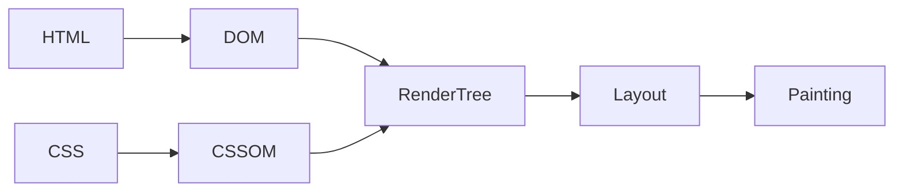

# React.js

Meta(Facebook)가 개발한 오픈소스 JavaScript 라이브러리. 대규모 웹 서비스의 UI를 더 편하게 개발하기 위해 만들어진 기술

## 리액트의 기술적인 특징

### 1. 컴포넌트를 기반으로 UI를 표현한다

페이지의 모든 요소들를 컴포넌트라는 단위로 모듈화해서 개발하기 때문에 여러 페이지에서 공통으로 사용되는 요소가 필요할때 컴포넌트를 만들고 컴포넌트를 여러 페이지에서 불러와서 사용하도록 만들어서 중복 코드가 발생하지 않는다. 유지보수 용이

### 2. 화면 업데이트 구현이 쉽다

업데이트란? 사용자의 행동(클릭, 드래그) 에 따라 웹 페이지가 스스로 모습을 바꿔 상호작용 하는것

선언형 프로그래밍? 과정은 생략하고 목적만 간결히 명시하는 방법. 코드가 간결함 (react)

명령형 프로그래밍? 목적을 이루기 위한 모든 일련의 과정을 설명하는 방식. 코드가 길고 복잡함 (javascript)

리액트에서는 각각의 컴포넌트에 State라는 현재의 컴포넌트의 상태를 저장하는 특수한 변수를 저장. 이 state 값이 바뀌면 컴포넌트가 바뀐 스테이트 값에 따라서 각각 다른 Ui를 화면에 렌더링(Rendering : 웹페이지 화면에 UI요소를 그려내는 것) 하도록 설정해 줄 수가 있다.

> 업데이트를 위한 복잡한 동작을 직접 정의할 필요 없이 특정 변수의 값을 바꾸는 것 만으로도 화면을 업데이트 시킬 수 있다

### 3. 화면 업데이트가 빠르게 처리된다

화면 업데이트를 쉽게 구현할 수 있으면서 동시에 빠르게도 처리해줌

#### 브라우저의 렌더링 과정 (Critical Rendering Path)



1. HTML과 CSS를 각각 DOM 이라는 것과 CSS Object Model 이라는 것으로 변환\

   - DOM(Document Object Model) : HTML의 코드를 브라우저가 자기가 더 이해하기 쉬운 방식으로 변환한 객체의 형태. HTML 문서를 일종의 객체 모델로 변환. 문서 객체 모델 Document Object Model (DOM) 이라 부른다
   - CSSOM : CSS를 브라우저가 자기가 더 이해하기 쉬운 형태로 변환한걸 CSS 오브젝트 모델 이라고 한다.

2. DOM 과 CSS 오브젝트 모델을 합쳐서 렌더 트리(웹페이지의 설계도)를 만든다. DOM에는 HTML로 표현한 요소들의 위치나 배치 모양 등에 관한 정보가 있고. CSS 오브젝트 모델에는 CSS 로 표현한 요소들의 스타일과 관련된 모든 정보가 있따. 이 두개를 합쳐서 만든 렌더 트리에는 화면에 나타나야되는, 즉 화면에 렌더링 되어야 하는 요소들의 모든 정보가 다 포함되어 있다.
3. 레이아웃 : 웹페이지라는 공간 안에 렌더트리에 포함되어 있는 요소들의 배치를 잡는다.
4. 페인팅 : 요소를 실제로 화면에 그려내는 과정

\*\* 레이아웃과 페인팅은 오래 걸리는 과정이다....

**?? 화면의 업데이트는 언제?**

DOM이 수정되면 브라우저는 Critical Rendering Path 의 전체 단계를 다시 수행한다. 랜더 트리를 다시 생성하고 레이아웃을 다시 잡고 페인팅을 다시 진행한다. 그럼으로써 화면에 그려지는, 렌더링되는 요소가 변경이 되면서 업데이트가 실제로 이루어 지게 된다.

- 리플로우 : 돔이 수정되어서 레이아웃이 다시 진행되는것.
- 리페인팅 : 돔이 수정되어서 페인팅 과정이 다시 진행되는것.

동시에 발생한 업데이트 들을 모아서 DOM 수정 횟수를 최소화 하는 작업을 React는 자동으로 해준다.
리액트는 내부적으로 Virtual DOM 이라는 가상의 DOM을 이용하고 있기 때문에 가능하다!

#### Virtual DOM

- DOM을 자바스크립트 객체로 흉내낸 것으로 일종의 복제판이라고 생각하면 된다
- React는 업데이트가 발생하면서 실제 DOM을 수정하기 전에 이 가상의 복제판 DOM에 먼저 반영해본다

실제 브라우저가 렌더링 하는 DOM을 Javascript 객체로 카피해 놓은 것. 리액트에서는 Virtual DOM을 이용해서 업데이트가 발생하면 실제 DOM을 수정하는것이 아니라 가상 DOM을 먼저 수정하도록 만든다. 자바스크립트 객체인 Virtual DOM 에 먼저 동시에 발생한 업데이트들을 순서대로 다 반영을 해 본뒤 업데이트들이 다 모이면 한방에 실제 DOM 에 반영. 아무리 많은 수의 업데이트가 발생한다고 해도 virtual DOM에 한번 다 모였다가 반영되는 거기 때문에 최소한의 횟수로 돔의 수정이 되고 결론적으로 좋은 업데이트 성능을 어느정도 보장해 준다.

## 설치

확장프로그램

- korean
- prettier : `ctrl` + `,` -> format on save 체크
- material icon : 설치후 창이 뜨면 material icon 클릭
- error lens
- live server : `ctrl` + `shift` + `p` -> live server: open with live server

`npm create vite@latest`

## JSX

확장된 자바스크립트 문법

### JSX 주의 사항

1. 중괄호 내부에는 자바스크립트 표현식만 넣을 수 있다
2. 숫자, 문자열, 배열 값만 렌더링 된다
3. 모든 태그는 닫혀있어야 한다
4. 최상위 태그는 반드시 하나여야만 한다
5. jsx에서는 class라는 예약어를 쓸수 없다 className으로 쓴다

```js
import "./Main.css";

const Main = () => {
  const user = {
    name: "이경화",
    isLogin: true,
  };

  if (user.isLogin) {
    return <div className="logout">로그아웃</div>;
  } else {
    return <div>로그인</div>;
  }

  // return (
  //   <>
  //     {user.isLogin ? (
  //       <div>로그아웃</div>
  //     ) : (
  //       <div>로그인</div>
  //     )}
  //   </>
  // );
};

export default Main;
```

## Props

컴포넌트에 전달된 값

```js
function App() {
  const buttonProps = {
    text: "메일",
    color: "red",
    a: 1,
    b: 2,
    c: 3,
  };
  return (
    <>
      <Button {...buttonProps} />
      <Button text={"카페"} />
      <Button text={"블로그"}>
        <Header /> // html 요소나 컴포넌트 children 프롭스로 전달 가능
      </Button>
    </>
  );
}
```

```jsx
const Button = ({ text, color, children }) => {
  return (
    <button style={{ color: color }}>
      {text} - {color.toUpperCase()}
      {children}
    </button>
  );
};

// React 19버전 이전에서 사용 19+ 부터는 구조분해할당문법으로
Button.defaultProps = {
  color: "black",
};

export default Button;
```

## Event Handling

웹에서 발생하는 사용자들의 모든 행동을 처리

- 합성 이벤트 (Synthetic Base Event) : 모든 브라우저의 이벤트 객체를 하나의 포맷으로 통일한 형태. 크로스 브라우징 이슈를 리액트에서 해결

```js
const Button = ({ text, color, children }) => {
  // e : 이벤트 객체
  const onClickButton = (e) => {
    console.log(e); // 합성이벤트객체 출력
    console.log(text);
  };

  return (
    <button
      onClick={onClickButton}
      // onMouseEnter={onClickButton}
      style={{ color: color }}
    >
      {text} - {color.toUpperCase()}
      {children}
    </button>
  );
};

Button.defaultProps = {
  color: "black",
};

export default Button;
```

## State

State(상태) : 어떠한 사물이 현재 가지고 있는 모양이나 형태를 정의. 변화할 수 있는 동적인 값. state 따라 렌더링 되는 ui 결정

- 리렌더/ 리렌더링 : 컴포넌트가 다시 렌더링 되는것

```js
import { useState } from "react";

function App() {
  const [count, setCount] = useState(0); // [0, f()] [state의 초기값, state 변경 함수]
  const [light, setLight] = useState("OFF");

  return (
    <>
      <div>
        <h1>{light}</h1>
        <button
          onClick={() => {
            setLight(light === "ON" ? "OFF" : "ON");
          }}
        >
          {light === "ON" ? "끄기" : "켜기"}
        </button>
      </div>
      <div>
        <h1>{count}</h1>
        <button
          onClick={() => {
            setCount(count + 1);
          }}
        >
          +
        </button>
      </div>
    </>
  );
}

export default App;
```

리랜더링 조건

1. 자신이 관리하는 state 변경
2. props 변경
3. 부모 컴포넌트 변경

```js
const Register = () => {
  const [input, setInput] = useState({
    // 객체 형태로 각각 하나의 변수로 관리하던 state를 하나로 관리할 수 있다
    name: "",
    gender: "",
    bio: "",
  });

  const onChange = (e) => {
    console.log(e.target.name + " : " + e.target.value);
    setInput({
      ...input, // 스프레드 연산자를 써서 기존 input 값 유지
      [e.target.name]: e.target.value,
    });
  };

  return (
    <div>
      <input
        name="name"
        value={input.name}
        onChange={onChange}
        placeholder={"이름"}
      />
    </div>
  );
};
```

## useRef

use reference 객체를 생성하는 기능 useState와 달리 컴포넌트를 리렌더링 시키지 않음.
컴포넌트가 렌더링하는 특정 DOM 요소에 접근 가능. 그럼으로써 해당 요소 조작 가능. 컴포넌트가 리랜더링된다고 해도 다시 초기화 되지 않음.

:::danger
컴포넌트 안에서 let 변수를 쓰면 컴포넌트 리랜더링 되어 초기화되어버린다. 컴포넌트 밖에서 let 변수를 쓰면 변수 공유되어버림.
:::

```js
import { useState, useRef } from "react";

const Register = () => {
  const countRef = useRef(0);
  const inputRef = useRef();

  const onChange = (e) => {
    countRef.current++;
  };

  const onSubmit = () => {
    if (input.name === "") {
      // 이름을 입력하는 DOM 요소 포커스
      inputRef.current.focus();
    }
  };

  return (
    <div>
      <div>
        <input
          ref={inputRef}
          name="name"
          value={input.name}
          onChange={onChange}
          placeholder={"이름"}
        />
      </div>
      <button onClick={onSubmit}>제출</button>
    </div>
  );
};

export default Register;
```

## React Hooks

2017년 이전 class 컴포넌트, 이후에는 Function 컴포넌트를 사용하게 되었다. Function 컴포넌트에서 class 컴포넌트에 있던 기능을 가져온 것이 Hooks.

- useState : State 기능을 낚아채온 Hook
- useRef : Reference 기능을 낚아채온 Hook

:::tip

1. 함수 컴포넌트, 커스텀 훅 내부에서만 호출 가능
1. 조건부로 호출될 수는 없다
1. 나만의 훅(Custom Hook) 직접 만들 수 있다.
   :::

- 커스텀 Hook : 컴포넌트 내부 Hook 을 사용하는 분리 가능. 접두사로 use를 붙여준다. src/hooks 폴더 안에 만들어 주는것이 일반적이다

`hooks/useInput.jsx`

```js
import { useState } from "react";

function useInput() {
  const [input, setInput] = useState("");

  const onChange = (e) => {
    setInput(e.target.value);
  };

  return [input, onChange];
}

export default useInput;
```

`HookExam.jsx`

```js
import useInput from "./../hooks/useInput";

const HookExam = () => {
  const [input, onChange] = useInput();
  const [input2, onChange2] = useInput();

  return (
    <div>
      <input value={input} onChange={onChange} />
      <input value={input2} onChange={onChange2} />
    </div>
  );
};

export default HookExam;
```

## state lifting

리액트에서는 부모에서 자식으로만 단방향으로 데이터 전달됨.
스테이트를 계층구조상에서 위로 끌어 올려서 그 아래에 있는 모든 컴포넌트들이 사용

## lifeCycle

생애주기

`mount` -> `update` -> `unmount`

- mount : 컴포넌트 탄생. 화면에 처음 렌더링 되는 순간
- update : 마운트 이후 컴포넌트가 리렌더링 되는 순간
- unmount : 컴포넌트가 화면에서 사라짐. 렌더링에서 제외되는 순간

## useEffect

컴포넌트의 사이드 이펙트를 제어하는 React Hook

```js
const [count, setCount] = useState(0);
const [input, setInput] = useState("");

useEffect(() => {
  console.log(`count: ${count} / input: ${input}`);
}, [count, input]);

const onClickButton = (value) => {
  setCount(count + value); // 비동기함수
};
```

## useEffect로 라이프사이클 제어하기

```jsx
const [count, setCount] = useState(0);

const isMount = useRef(false);

// 1. 마운트 : 탄생
useEffect(() => {
  console.log("mount");
}, []);

// 2. 업데이트 : 변화, 리렌더링
useEffect(() => {
  if (!isMount.current) {
    isMount.current = true;
    return;
  }
  console.log("update");
});

// 3. 언마운트 : 죽음
useEffect(() => {
  // 클린업, 정리함수
  return () => {
    console.log("Even 컴포넌트가 언마운트 되었습니다.");
  };
}, []);
return <div>짝수입니다</div>;
```

## React Developers Tool 설치

[React Developers Tool](https://chromewebstore.google.com/detail/react-developer-tools/fmkadmapgofadopljbjfkapdkoienihi?hl=ko)

## useReducer

UseState : 상태관리 코드를 내부에서 작성해야함

UseReducer : state를 관리하는 코드들은 reducer 라는 함수를 통해서 컴퍼넌트 내부에서 관리하도록 코드를 분리

```js
import { useReducer } from "react";

// reducer : 변환기
// -> 상태를 실제로 변화시키는 변환기 역할
function reducer(state, action) {
  switch (action.type) {
    case "INCREASE":
      return state + action.data;
    case "DECREASE":
      return state - action.data;
    default:
      return state;
  }
}

const Exam = () => {
  // dispatch : 발송하다, 급송하다
  // -> 상태 변화가 있어야 한다는 사실을 알리는, 발송하는 함수
  const [state, dispatch] = useReducer(reducer, 0);

  const onClickPlus = () => {
    // 인수: 상태가 어떻게 변화되길 원하는지
    // -> 액션 객체
    dispatch({
      type: "INCREASE",
      data: 1,
    });
  };

  const onClickMinus = () => {
    dispatch({
      type: "DECREASE",
      data: 1,
    });
  };

  return (
    <div>
      <h1>{state}</h1>
      <button onClick={onClickPlus}>+</button>
      <button onClick={onClickMinus}>-</button>
    </div>
  );
};

export default Exam;
```

### 최적화

서비스의 성능을 개선하는 모든 행위

### React 앱 내부의 최적화 방법

컴포넌트 내부의 불필요한 연산 방지

컴포넌트 내부의 불필요한 함수 재생성 방지
컴포넌트의 불 필요한 리렌더링 방지

## useMemo

메모이제이션 기법을 기반으로 불필요한 연산을 최적화하는 리액트 훅

```js
import "./List.css";
import TodoItem from "./TodoItem";
import { useState, useMemo } from "react";

const List = ({ todos, onUpdate, onDelete }) => {
  const [search, setSearch] = useState("");

  const onChangeSearch = (e) => {
    setSearch(e.target.value);
  };

  const getFilteredData = () => {
    if (search === "") {
      return todos;
    }
    return todos.filter((todo) =>
      todo.content.toLowerCase().includes(search.toLowerCase())
    );
  };

  const filteredTodos = getFilteredData();

  const { totalCount, doneCount, notDoneCount } = useMemo(() => {
    console.log("getAnalyzedData 호출!");
    const totalCount = todos.length;
    const doneCount = todos.filter((todo) => todo.isDone).length;
    const notDoneCount = totalCount - doneCount;

    return {
      totalCount,
      doneCount,
      notDoneCount,
    };
  }, [todos]);
  // 의존성배열 : deps

  return (
    <div className="List">
      <h4>Todo List 🌱</h4>
      <div>
        <div>total: {totalCount}</div>
        <div>done: {doneCount}</div>
        <div>notDone: {notDoneCount}</div>
      </div>
      <input
        value={search}
        onChange={onChangeSearch}
        placeholder="검색어를 입력하세요"
      />
      <div className="todos_wrapper">
        {filteredTodos.map((todo) => {
          return (
            <TodoItem
              key={todo.id}
              {...todo}
              onUpdate={onUpdate}
              onDelete={onDelete}
            />
          );
        })}
      </div>
    </div>
  );
};

export default List;
```

## React.memo

컴포넌트를 인수로 받아, 최적화된 컴포넌트로 만들어 변환

```js
Const memoizedComponent = memo(Component)
// 반환관. 최적화된 컴포넌트 Props를 기준으로 메모이제이션 됨
```

```js
import "./Header.css";
import { memo } from "react";

const Header = () => {
  return (
    <div className="Header">
      <h3>오늘은 📆</h3>
      <h1>{new Date().toDateString()}</h1>
    </div>
  );
};

export default memo(Header);
```

```js
// 고차 컴포넌트 (HOC)
export default memo(TodoItem, (prevProps, nextProps) => {
  // 반환값에 따라, Props가 바뀌었는지 안바뀌었지 판단
  // T -> Props 바뀌지 않음 -> 리렌더링 X
  // F -> Props 바뀜 -> 리렌더링 O

  if (prevProps.id !== nextProps.id) return false;
  if (prevProps.isDone !== nextProps.isDone) return false;
  if (prevProps.content !== nextProps.content) return false;
  if (prevProps.date !== nextProps.date) return false;

  return true;
});
```

## useCallback

```js
const onCreate = useCallback((content) => {
  dispatch({
    type: "CREATE",
    data: {
      id: idRef.current++,
      isDone: false,
      content: content,
      date: new Date().getTime(),
    },
  });
}, []);
```

## React Context

컴포넌트간의 데이터를 전달하는 또 다른 방법
기존의 props가 가지고 있던 단점 해결 => props drilling 해결

## Route

```js
import "./App.css";
import { Routes, Route, Link, useNavigate } from "react-router-dom";
import Home from "./pages/Home";
import Diary from "./pages/Diary";
import New from "./pages/New";
import Notfound from "./pages/Notfound";

// 1. "/" : 모든 일기를 조회하는 Home 페이지
// 2. "/new" : 새로운 일기를 작성하는 New 페이지
// 3. "/diary" : 일기를 상세히 조회하는 Diary 페이지
function App() {
  const nav = useNavigate();

  const onClickButton = () => {
    nav("/new");
  };

  return (
    <>
      <div>
        <Link to={"/"}>Home</Link>
        <Link to={"/new"}>New</Link>
        <Link to={"/diary"}>Diary</Link>
      </div>
      <button onClick={onClickButton}>New 페이지로 이동</button>
      <Routes>
        <Route path="/" element={<Home />} />
        <Route path="/new" element={<New />} />
        <Route path="/diary" element={<Diary />} />
        <Route path="*" element={<Notfound />} />
      </Routes>
    </>
  );
}

export default App;
```

## Dynamix Segments

- Url Parameter

```js
<Route path="/diary/:id" element={<Diary />} />
```

```js
import { useParams } from "react-router-dom";

const Diary = () => {
  const params = useParams();
  console.log(params);

  return <div>{params.id}번 일기입니다 ~~</div>;
};

export default Diary;
```

- Query String

```js
import { useSearchParams } from "react-router-dom";

const Home = () => {
  const [params, setParams] = useSearchParams();
  console.log(params.get("value"));

  return <div>Home</div>;
};

export default Home;
```
