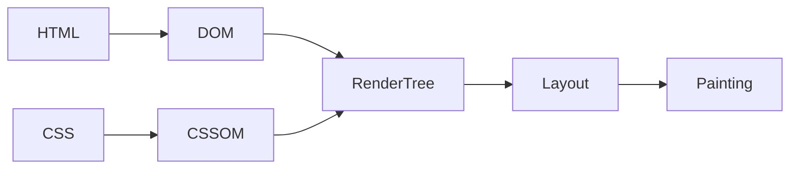

# React.js

Meta(Facebook)가 개발한 오픈소스 JavaScript 라이브러리. 대규모 웹 서비스의 UI를 더 편하게 개발하기 위해 만들어진 기술

## 리액트의 기술적인 특징

### 1. 컴포넌트를 기반으로 UI를 표현한다

페이지의 모든 요소들를 컴포넌트라는 단위로 모듈화해서 개발하기 때문에 여러 페이지에서 공통으로 사용되는 요소가 필요할때 컴포넌트를 만들고 컴포넌트를 여러 페이지에서 불러와서 사용하도록 만들어서 중복 코드가 발생하지 않는다. 유지보수 용이

### 2. 화면 업데이트 구현이 쉽다

업데이트란? 사용자의 행동(클릭, 드래그) 에 따라 웹 페이지가 스스로 모습을 바꿔 상호작용 하는것

선언형 프로그래밍? 과정은 생략하고 목적만 간결히 명시하는 방법. 코드가 간결함 (react)

명령형 프로그래밍? 목적을 이루기 위한 모든 일련의 과정을 설명하는 방식. 코드가 길고 복잡함 (javascript)

리액트에서는 각각의 컴포넌트에 State라는 현재의 컴포넌트의 상태를 저장하는 특수한 변수를 저장. 이 state 값이 바뀌면 컴포넌트가 바뀐 스테이트 값에 따라서 각각 다른 Ui를 화면에 렌더링(Rendering : 웹페이지 화면에 UI요소를 그려내는 것) 하도록 설정해 줄 수가 있다.

> 업데이트를 위한 복잡한 동작을 직접 정의할 필요 없이 특정 변수의 값을 바꾸는 것 만으로도 화면을 업데이트 시킬 수 있다

### 3. 화면 업데이트가 빠르게 처리된다

화면 업데이트를 쉽게 구현할 수 있으면서 동시에 빠르게도 처리해줌

#### 브라우저의 렌더링 과정 (Critical Rendering Path)

1. HTML과 CSS를 각각 DOM 이라는 것과 CSS Object Model 이라는 것으로 변환\

   - DOM(Document Object Model) : HTML의 코드를 브라우저가 자기가 더 이해하기 쉬운 방식으로 변환한 객체의 형태. HTML 문서를 일종의 객체 모델로 변환. 문서 객체 모델 Document Object Model (DOM) 이라 부른다
   - CSSOM : CSS를 브라우저가 자기가 더 이해하기 쉬운 형태로 변환한걸 CSS 오브젝트 모델 이라고 한다.

2. DOM 과 CSS 오브젝트 모델을 합쳐서 렌더 트리(웹페이지의 설계도)를 만든다. DOM에는 HTML로 표현한 요소들의 위치나 배치 모양 등에 관한 정보가 있고. CSS 오브젝트 모델에는 CSS 로 표현한 요소들의 스타일과 관련된 모든 정보가 있따. 이 두개를 합쳐서 만든 렌더 트리에는 화면에 나타나야되는, 즉 화면에 렌더링 되어야 하는 요소들의 모든 정보가 다 포함되어 있다.
3. 레이아웃 : 웹페이지라는 공간 안에 렌더트리에 포함되어 있는 요소들의 배치를 잡는다.
4. 페인팅 : 요소를 실제로 화면에 그려내는 과정

\*\* 레이아웃과 페인팅은 오래 걸리는 과정이다....

**?? 화면의 업데이트는 언제?**

DOM이 수정되면 브라우저는 Critical Rendering Path 의 전체 단계를 다시 수행한다. 랜더 트리를 다시 생성하고 레이아웃을 다시 잡고 페인팅을 다시 진행한다. 그럼으로써 화면에 그려지는, 렌더링되는 요소가 변경이 되면서 업데이트가 실제로 이루어 지게 된다.

- 리플로우 : 돔이 수정되어서 레이아웃이 다시 진행되는것.
- 리페인팅 : 돔이 수정되어서 페인팅 과정이 다시 진행되는것.

동시에 발생한 업데이트 들을 모아서 DOM 수정 횟수를 최소화 하는 작업을 React는 자동으로 해준다.
리액트는 내부적으로 Virtual DOM 이라는 가상의 DOM을 이용하고 있기 때문에 가능하다!

#### Virtual DOM

- DOM을 자바스크립트 객체로 흉내낸 것으로 일종의 복제판이라고 생각하면 된다
- React는 업데이트가 발생하면서 실제 DOM을 수정하기 전에 이 가상의 복제판 DOM에 먼저 반영해본다

실제 브라우저가 렌더링 하는 DOM을 Javascript 객체로 카피해 놓은 것. 리액트에서는 Virtual DOM을 이용해서 업데이트가 발생하면 실제 DOM을 수정하는것이 아니라 가상 DOM을 먼저 수정하도록 만든다. 자바스크립트 객체인 Virtual DOM 에 먼저 동시에 발생한 업데이트들을 순서대로 다 반영을 해 본뒤 업데이트들이 다 모이면 한방에 실제 DOM 에 반영. 아무리 많은 수의 업데이트가 발생한다고 해도 virtual DOM에 한번 다 모였다가 반영되는 거기 때문에 최소한의 횟수로 돔의 수정이 되고 결론적으로 좋은 업데이트 성능을 어느정도 보장해 준다.

## 설치

확장프로그램

- korean
- prettier : `ctrl` + `,` -> format on save 체크
- material icon : 설치후 창이 뜨면 material icon 클릭
- error lens
- live server : `ctrl` + `shift` + `p` -> live server: open with live server
