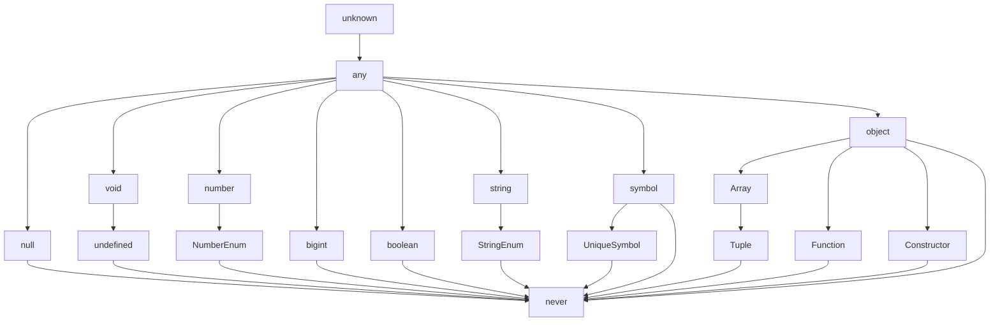

# typescript

## hello TS world

```sh
npm init # node 초기화
npm i @types/node # 타입스크립트 설치
npm install typescript -g # 컴파일러 설치
# -g (글로벌 옵션) : 컴퓨터 모든곳에서 사용 가능
tsc -v # 버전 확인
```

`src.index.ts`

```js
console.log("hello typescript");
const a: number = 5;
```

```sh
tsc src/index.ts # 컴파일
node src/index.js # 실행
```

### 컴파일과 실행을 한번에 tsx

```sh
npm i -g tsx
tsx -v
tsx src/index.ts
```

### tsconfig.json 파일 만들기

```sh
tsc --init
```

```json
`tsconfig.json`
{
  "compilerOptions": {
    "target": "ESNext", // 변환되는 자바스크립트 버전
    "module": "ESNext", // 변환되는 자바스크립트 코드가 사용할 모듈 시스템버전
    "outDir": "dist", // 컴파일된 자바스크립트 폴뎌
    "strict": false, // 엄격한 검사
    "moduleDetection": "force", // 개별 모듈로 취급
    "moduleResolution": "node",
    "skipLibCheck": true,
  },
  "include": ["src"] // 폴더 안에 파일 컴파일
}
```

- 타입스크립트는 모든 파일을 전역 모듈로 본다 export{} 처럼 모듈 키워드를 쓰면 그때부터 독립된 모듈로 본다. 또는 tsconfig.json 파일에 moduleDetection : force 옵션을 준다.

```sh
npm install -D @types/node@20
```

## 타입스크립트 기본타입

### 원시타입

하나의 값만 저장하는 타입

`: number` = 타입 어노테이션

```ts
// number
let num1: number = 123;
let num2: number = -123;
let num3: number = 0.123;
let num4: number = -0.123;
let num5: number = Infinity;
let num6: number = -Infinity;
let num7: number = NaN;

// string
let str1: string = "hello";
let str2: string = "hello";
let str3: string = `hello`;
let str4: string = `hello ${num1}`;

// boolean
let bool1: boolean = true;
let bool2: boolean = false;

// null
let null1: null = null;

// undefined
let unde1: undefined = undefined;
```

number 타입에 임시로 null 을 넣고 싶을때  
null 타입이 아닌 변수에 null을 넣을 수 있다.

`tsconfig.json`

```json
"strictNullChecks": false,
```

### 리터럴 타입

값 자체가 타입이 된다
타입으로 정의된 값 외에 다른 값은 들어갈 수 없다

```ts
// 리터럴 타입
// 리터럴 -> 값
let numA: 10 = 10;

let strA: "hello" = "hello";
```

### 배열

```ts
// 배열
let numArr: number[] = [1, 2, 3];

let strArr: string[] = ["hello", "im", "winterlood"];

let boolArr: Array<boolean> = [true, false, true]; // 제네릭

// 배열에 들어가는 요소들의 타입이 다양할 경우
let multiArr: (number | string)[] = [1, "hello"];

// 다차원 배열의 타입을 정의하는 방법
let doubleArr: number[][] = [
  [1, 2, 3],
  [4, 5],
];
```

### 튜플

자바스크립트에는 없고 타입스크립트에만 제공
길이와 타입이 고정된 배열

```ts
let tup1: [number, number] = [1, 2];

let tup2: [number, string, boolean] = [1, "2", true];

const users: [string, number][] = [
  ["이이이", 1],
  ["이아무개", 2],
  ["김아무개", 3],
  ["박아무개", 4],
  //   [5, "최아무개"],
];
```

### 객체

- ? : 선택적 프로퍼티 optional property 있어도 되고 없어도 됨
- readonly : 수정 불가

```ts
let user: {
  id?: number;
  name: string;
} = {
  id: 1,
  name: "이이이",
};

let config: {
  readonly apiKey: string;
} = {
  apiKey: "MY API KEY",
};

// config.apiKey = "hacked";
```

### 타입 별칭 (type alias)

타입을 변수처럼

```ts
type User = {
  id: number;
  name: string;
  nickname: string;
  birth: string;
  bio: string;
  location: string;
};

let user: User = {
  id: 1,
  name: "이이이",
  nickname: "winterlood",
  birth: "1997.01.07",
  bio: "안녕하세요",
  location: "부천시",
};

function test() {
  type User = string; // 함수 안에서 User 타입은 string 이 된다
}
```

### 인덱스 시그니처

```ts
type CountryCodes = {
  [key: string]: string;
};

let countryCodes: CountryCodes = {
  Korea: "ko",
  UnitedState: "us",
  UnitedKingdom: "uk",
};

type CountryNumberCodes = {
  [key: string]: number;
  Korea: number; // Korea 프로퍼티가 반드시 있어야 한다
};

type CountryNumberCodes = {
  [key: string]: number;
  Korea: string; // 인덱스시그니처 타입과 반드시 일치해야 한다 오류발생
};

// let countryNumberAndStringCodes: CountryNumberCodes = {
//   Korea: "ko",
// };
```

### 열거형 타입 (Enum Type)

타입스크립트에서만 제공

```ts
enum Role {
  ADMIN,
  USER,
  GUEST,
}

enum Language {
  korean = "ko",
  english = "en",
}

const user1 = {
  name: "이이이",
  role: Role.ADMIN, // 0 <- 관리자
  language: Language.korean,
};

const user2 = {
  name: "홍길동",
  role: Role.USER, // 1 <- 일반 유저
  language: Language.english,
};

const user3 = {
  name: "아무개",
  role: Role.GUEST, // 2 <- 게스트
};

console.log(user1, user2, user3);
```

### Any

특정 변수의 타입을 확실히 모를때

```ts
let anyVar: any = 10;

let num: number = 10;
num = anyVar; // 가능 unkown 은 불가능
```

### Unknown

```ts
let unknownVar: unknown;

unknownVar = "";
unknownVar = 1;
unknownVar = () => {};

if (typeof unknownVar === "number") {
  // 타입 정제
  num = unknownVar;
}
```

### void

```ts
function func1(): string {
  return "hello";
}

function func2(): void {
  console.log("hello");
}
```

### never

불가능한 타입
strictNullChecks : false 여도 값을 담을 수 없음. anytype 도 담을 수 없다
(void 타입은 담을 수 있다)

```ts
function func3(): never {
  while (true) {}
}

function func4(): never {
  throw new Error();
}

let anyVar: any;

let a: never;
// a = 1;
// a = {};
// a = "";
// a = undefined;
// a = null;
// a = anyVar;
```

## 타입은 집합이다



\*\* 밑에서 위로 변수 할당 가능
\*\* anytype은 다운캐스팅/업케스팅 무시
\*\* never 타입에는 anytype 들어가지 못한다

## 객체 타입의 호환성

```ts
type Animal = {
  name: string;
  color: string;
};

type Dog = {
  name: string;
  color: string;
  breed: string;
};

let animal: Animal = {
  name: "기린",
  color: "yellow",
};

let dog: Dog = {
  name: "돌돌이",
  color: "brown",
  breed: "진도",
};

animal = dog;
// dog = animal; 오류 발생
```

animal 은 dog의 슈퍼타입/ dog 는 animal 의 서브타입

## 초과 프로퍼티 검사

```ts
type Book = {
  name: string;
  price: number;
};

let book2: Book = {
  name: "한 입 크기로 잘라먹는 리액트",
  price: 33000,
  //   skill: "reactjs", skill 작성 불가
};
```

## 대수 타입

여러개의 타입을 합성해서 새롭게 만들어낸 타입

### union 타입 (합집합 타입)

```ts
let a: string | number | boolean;
a = 1;
a = "hello";
a = true;

let arr: (number | string | boolean)[] = [1, "hello", true];
```

```ts
type Dog = {
  name: string;
  color: string;
};

type Person = {
  name: string;
  language: string;
};

type Union1 = Dog | Person; // 타입 별칭으로도 union 타입을 만들 수 있다

let union1: Union1 = {
  // Dog
  name: "",
  color: "",
};

let union2: Union1 = {
  // Person
  name: "",
  language: "",
};

let union3: Union1 = {
  // Dog | Person
  name: "",
  color: "",
  language: "",
};

// 허용 안됨
// let union4: Union1 = {
//   name: "",
// };
```

### Intersection 타입 (교집합 타입)

```ts
let variable: number & string; // => never 타입 (불가능.. 공집합)
```

객체 타입에서 주로 많이 사용한다

```ts
type Dog = {
  name: string;
  color: string;
};

type Person = {
  name: string;
  language: string;
};

type Intersection = Dog & Person;

// 프로퍼티가 하나라도 빠지면 안된다 모든 프로퍼티를 포함하는 타입
let intersection1: Intersection = {
  name: "",
  color: "",
  language: "",
};
```

### 타입 추론 (Type Inference)

타입이 정의되어 있지 않은 변수의 타입을 자동으로 추론

#### any type의 진화

```ts
let d; // any
d = 10; // any
d.toFixed(); // number

d = "hello"; // any
d.toUpperCase(); // string
```

변수를 선언하기만 하면 암묵적인 any타입으로 지정됨. 암묵적인 any type은 진화가능.

#### const

```ts
const num = 10; // const 는 넘버리터럴타입으로 추론됨
const str = "hello";
```

#### 최적의 공통타입으로 추론해준다

```ts
let arr = [1, "string"]; // let arr: (string | number)[]
```

### 타입 단언 (Type Assertion)

실제로 타입을 바꾸는것은 아니다. 컴파일러에게 잠시 단언해서 오류를 피함

타입 단언의 규칙

- 값 as 단언 <- 단언식
- A as B
- A가 B의 슈퍼타입이거나
- A가 B의 서브타입이어야 함

```ts
type Person = {
  name: string;
  age: number;
};

let person = {} as Person;
person.name = "이이이";
person.age = 27;
```

```ts
type Dog = {
  name: string;
  color: string;
};

let dog = {
  name: "돌돌이",
  color: "brown",
  breed: "진도",
} as Dog;
```

```ts
let num1 = 10 as never;
let num2 = 10 as unknown;

let num3 = 10 as unknown as string; // 다중 단언 좋은 방법은 아니다
```

#### const 단언

readonly 로 추론됨. 모든 프로퍼티를 readonly로 만들어준다

```ts
let num4 = 10 as const;

let cat = {
  name: "야옹이", // readonly 로 추론됨
  color: "yellow", // readonly 로 추론됨
} as const;
```

#### Non null 단언

```ts
type Post = {
  title: string;
  author?: string;
};

let post: Post = {
  title: "게시글1",
};

const len: number = post.author!.length; // ? => !
// ! : 이 값이 null 이거나 undefined이 아닐것이다 라고 단언
```

### 타입 좁히기

조건문 등을 이용해 넓은타입에서 좁은타입으로 타입을 상황에 따라 좁히는 방법

```ts
type Person = {
  name: string;
  age: number;
};

// value => number : toFixed
// value => string : toUpperCase
// value => Date : getTime
// value => Person : name은 age살 입니다.
function func(value: number | string | Date | null | Person) {
  // 여기서는 toFixed 나 toUpperCase 사용 불가
  // 타입 가드
  if (typeof value === "number") {
    console.log(value.toFixed());
  } else if (typeof value === "string") {
    console.log(value.toUpperCase());
  } else if (value instanceof Date) {
    console.log(value.getTime());
  } else if (value && "age" in value) {
    console.log(`${value.name}은 ${value.age}살 입니다`);
  }
}
```

### 서로소 유니온 타입

```ts
type LoadingTask = {
  state: "LOADING";
};

type FailedTask = {
  state: "FAILED";
  error: {
    message: string;
  };
};

type SuccessTask = {
  state: "SUCCESS";
  response: {
    data: string;
  };
};

type AsyncTask = LoadingTask | FailedTask | SuccessTask;

function processResult(task: AsyncTask) {
  switch (task.state) {
    case "LOADING": {
      console.log("로딩 중");
      break;
    }
    case "FAILED": {
      console.log(`에러 발생 : ${task.error.message}`);
      break;
    }
    case "SUCCESS": {
      console.log(`성공 : ${task.response.data}`);
      break;
    }
  }
}
```

## 함수 타입

어떤 [타입의] 매개변수를 받고, 어떤 [타입의] 결과값을 반환하는지 함수를 설명

### 함수 선언식

```ts
function func(a: number, b: number) {
  return a + b; // number로 추론 된다
}
```

### 화살표 함수

```ts
const add = (a: number, b: number) => a + b;
```

### 함수의 매개변수

```ts
function introduce(name = "이이이", age: number, tall?: number) {
  console.log(`name : ${name}`);
  if (typeof tall === "number") {
    console.log(`tall : ${tall + 10}`);
  }
}

introduce("이이이", 27, 175);

introduce("이이이", 27);
```

### rest파라미터

```ts
function getSum(...rest: []) {
  let sum = 0;
  rest.forEach((it) => (sum += it));

  return sum;
}

function getSum(...rest: [number, number, number]) {
  let sum = 0;
  rest.forEach((it) => (sum += it));

  return sum;
}

getSum(1, 2, 3); // 6
// getSum(1, 2, 3, 4, 5); // 15
```

### 함수 타입 표현식

```ts
type Operation = (a: number, b: number) => number;

const add: (a: number, b: number) => number = (a, b) => a + b;
const sub: Operation = (a, b) => a - b;
```

### 호출 시그니처 (콜 시그니쳐)

```ts
type Operation2 = {
  (a: number, b: number): number;
  name: string;
}; // 하이브리드타입

const add2: Operation2 = (a, b) => a + b;
const sub2: Operation2 = (a, b) => a - b;
const multiply2: Operation2 = (a, b) => a * b;
const divide2: Operation2 = (a, b) => a / b;

// add2();
// add2.name
```

### 함수타입의 호환성

특정 함수 타입을 다른 함수 타입으로 취급해도 괜찮은가

1. 반환값의 타입이 호환되는가 : **!!다운캐스팅은 불가능**
2. 매개변수의 타입이 호환되는가 : **!!업캐스팅은 불가능**

   2-1. 매개변수의 개수가 같을 때

   ```ts
   type C = (value: number) => void;
   type D = (value: 10) => void;

   let c: C = (value) => {};
   let d: D = (value) => {};

   // c = d;
   d = c;
   ```

   2-2. 매개변수의 개수가 다를 때

   ```ts
   type Func1 = (a: number, b: number) => void;
   type Func2 = (a: number) => void;

   let func1: Func1 = (a, b) => {};
   let func2: Func2 = (a) => {};

   func1 = func2;
   // func2 = func1;
   ```

### 함수 오버로딩

하나의 함수를 매개변수의 개수나 타입에 따라 여러가지 버전으로 만드는 문법. 타입스크립트에서만 지원

```ts
// 버전들 -> 오버로드 시그니쳐
function func(a: number): void;
function func(a: number, b: number, c: number): void;

// 실제 구현부 -> 구현 시그니쳐
function func(a: number, b?: number, c?: number) {
  if (typeof b === "number" && typeof c === "number") {
    console.log(a + b + c);
  } else {
    console.log(a * 20);
  }
}

func(1);
func(1, 2, 3);
```

### 사용자 정의 타입 가드

```ts
type Dog = {
  name: string;
  isBark: boolean;
};

type Cat = {
  name: string;
  isScratch: boolean;
};

type Animal = Dog | Cat;

function isDog(animal: Animal): animal is Dog {
  return (animal as Dog).isBark !== undefined;
}

function isCat(animal: Animal): animal is Cat {
  return (animal as Cat).isScratch !== undefined;
}

function warning(animal: Animal) {
  if (isDog(animal)) {
    // 강아지
    animal;
  } else if ("isScratch" in animal) {
    // 고양이
  }
}
```

## 인터페이스

호출 시그니처로 오버로드 구현 가능

```ts
interface Person {
  readonly name: string;
  age?: number;
  sayHi(): void;
  sayHi(a: number, b: number): void;
}

const person: Person = {
  name: "이정환",
  sayHi: function () {
    console.log("Hi");
  },
};

person.sayHi();
person.sayHi(1, 2);
```

### 인터페이스 확장

```ts
type Animal = {
  name: string;
  color: string;
};

interface Dog extends Animal {
  isBark: boolean;
}

interface Cat extends Animal {
  isScratch: boolean;
}

const dog: Dog = {
  name: "", // 원본 타입의 서브타입 다시 정의 가능
  color: "",
  isBark: true,
};

interface DogCat extends Dog, Cat {}

const dogCat: DogCat = {
  name: "",
  color: "",
  isBark: true,
  isScratch: true,
};
```

### 선언 합침

```ts
interface Person {
  name: string;
}

interface Person {
  name: string;
  age: number;
}

interface Developer extends Person {
  name: "hello";
}

const person: Person = {
  name: "",
  age: 27,
};
```

## 모듈 보강

선언 병합은 이미 정의된 타입(특히 라이브러리 타입)에 새로운 속성이나 메소드를 추가하여 타입 정의를 확장할 때 유용하게 사용됩니다. 이를 모듈 보강이라고 합니다.

```ts
interface Lib {
  a: number;
  b: number;
}

interface Lib {
  c: string;
}

const lib: Lib = {
  a: 1,
  b: 2,
  c: "hello",
};
```

## 자바스크립트 클래스

```js
class Student {
  // 필드
  name;
  grade;
  age;

  // 생성자
  constructor(name, grade, age) {
    this.name = name;
    this.grade = grade;
    this.age = age;
  }

  // 메서드
  study() {
    console.log("열심히 공부 함");
  }

  introduce() {
    console.log(`안녕하세요 ${this.name} 입니다!`);
  }
}

class StudentDeveloper extends Student {
  // 필드
  favoriteSkill;

  // 생성자
  constructor(name, grade, age, favoriteSkill) {
    super(name, grade, age);
    this.favoriteSkill = favoriteSkill;
  }

  // 메서드
  programming() {
    console.log(`${this.favoriteSkill}로 프로그래밍 함`);
  }
}
```

클래스를 이용해서 만든 객체 -> 인스턴스

스튜던트 인스턴스

```js
let studentB = new Student("홍길동", "A+", 27);
console.log(studentB);
studentB.study();
studentB.introduce();
```

## 타입스크립트 클래스

```ts
class Employee {
  // 필드
  name: string;
  age: number;
  position: string;

  // 생성자
  constructor(name: string, age: number, position: string) {
    this.name = name;
    this.age = age;
    this.position = position;
  }

  // 메서드
  work() {
    console.log("일함");
  }
}

const employeeB = new Employee("이정환", 27, "개발자");
console.log(employeeB);
```

자바스크립트의 클래스 이면서 하나의 타입

```ts
const employeeC: Employee = {
  name: "",
  age: 0,
  position: "",
  work() {},
};
```

### super

타입스크립트에서는 생략하면 오류발생

```ts
class ExecutiveOfficer extends Employee {
  // 필드
  officeNumber: number;

  // 생성자
  constructor(
    name: string,
    age: number,
    position: string,
    officeNumber: number
  ) {
    super(name, age, position); // 부모클래스의 생성자
    this.officeNumber = officeNumber;
  }
}
```

### 접근제어자(access modifier)

#### public

접근 가능

#### private

접근 불가

#### proteced

파생클래스에서는 접근 가능

#### 생성자에 접근제어자 붙이면 필드 자동생성됨 필드 생략 가능

```ts
class Employee {
  // 필드

  // 생성자
  constructor(
    private name: string,
    protected age: number,
    public position: string
  ) {}

  // 메서드
  work() {
    console.log(`${this.name} 일함`);
  }
}
```

### 인터페이스와 클래스

